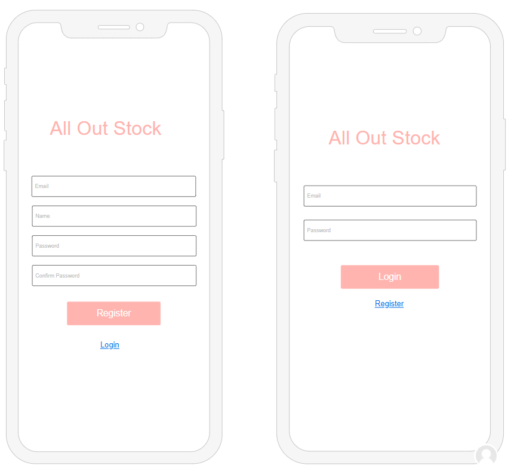
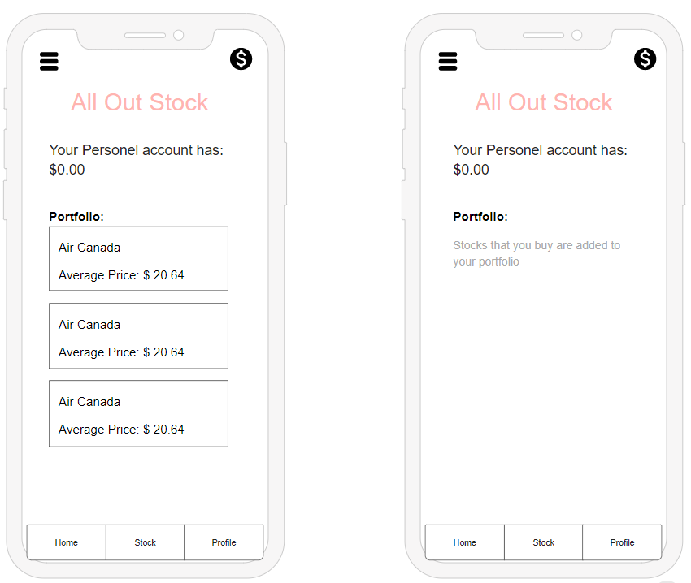
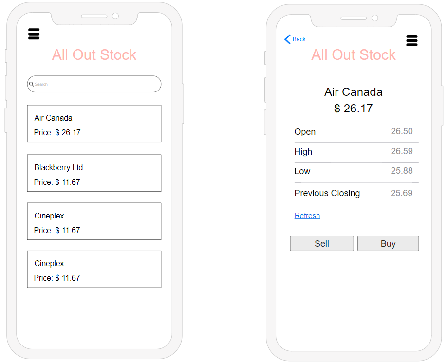
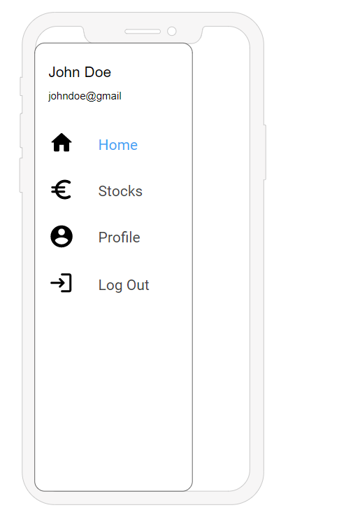
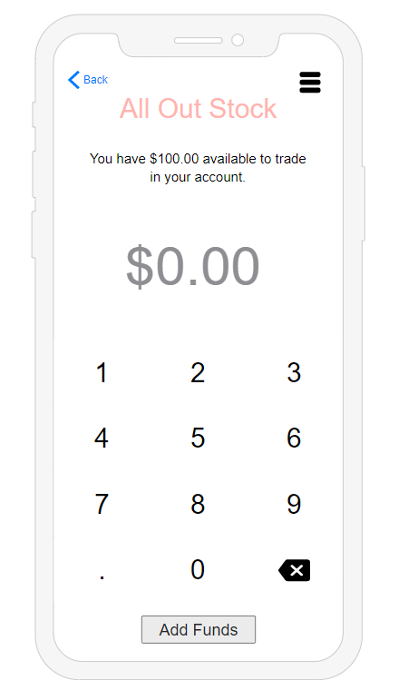
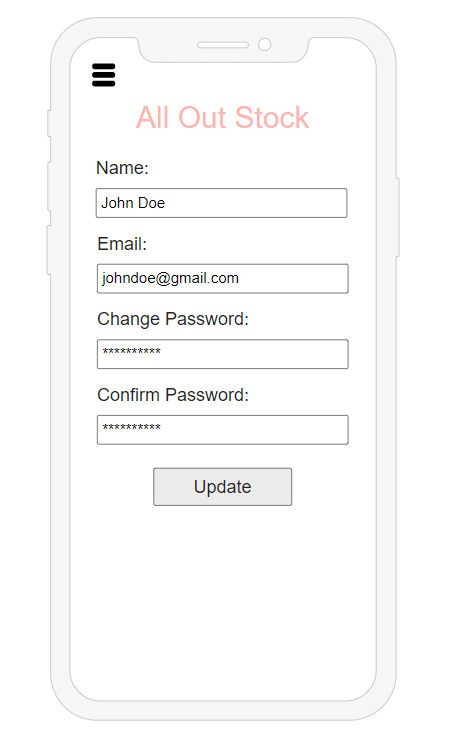
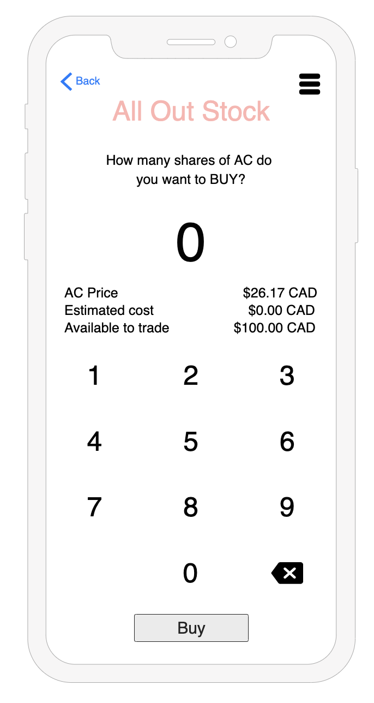

# All Out Stock (Team 7 Mobile Project)

## Platform Choice: React-Native

## Dependences for installation

-   yarn add firebase
-   yarn add @react-navigation/native && yarn add @react-navigation/stack && expo install react-native-gesture-handler react-native-reanimated react-native-screens react-native-safe-area-context @react-native-community/masked-view
-   yarn add react-native-keyboard-aware-scroll-view base-64
-   npm install finnhub --save
-   npm install querystring

## Prototypes Images

-   Register Screen
    

-   Home Screen
    

-   Stock Screen
    

-   Navigation
    

-   Funds Screen
    

-   Profile Screen
    

-   Buy and Sell Screen
    
